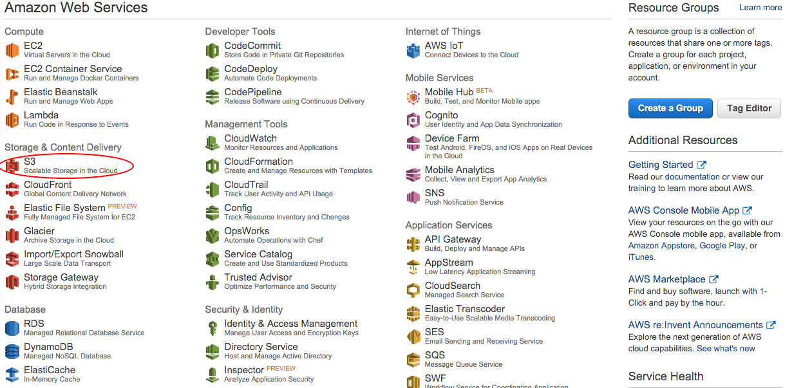
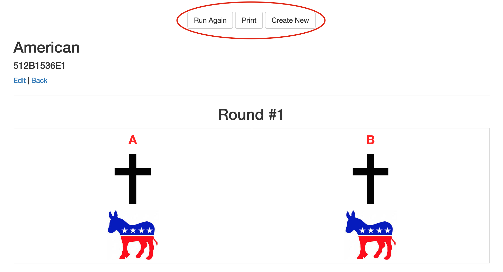
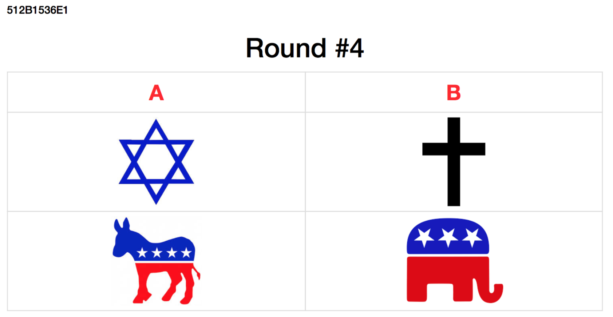
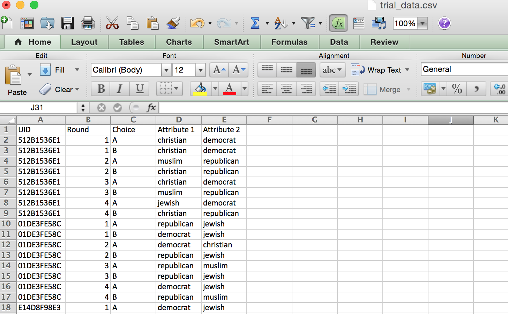

# Conjoint PDF Generator App

A Rails app for producing offline conjoint PDFs. A hosted version of this app (through MIT GovLab) can be found <a href="https://conjoint-pdf-app.herokuapp.com/users/sign_in" target="_blank">here</a>.

## Setup

This is a <a href="http://rubyonrails.org/" target="_blank">Ruby on Rails</a> 4.2.0 app. For more information on how to install this app on <a href="http://heroku.com/" target="_blank">Heroku</a> see below.

If you want to run this app locally on your own computer you need to have the 4.2.0 version of Ruby on Rails installed on your local machine. If you are using a web server other than Heroku it will need to have Rails instaled on it. For instructions for how to install Ruby on Rails visit <a href="http://installrails.com/" target="_blank">this link</a>.

If you are using images instead of text in your conjoint experiment, you will need to have an Amazon Web Service account and add your credentials. For more information see below.

### Heroku

The easiest way to use this app is to click on the button below that says "Deploy to Heroku". In order to use this method, you will need to have a Heroku account. It is easy and free to sign up for a Heroku account, which can be done <a href="https://signup.heroku.com/?c=70130000001x9jFAAQ" target="_blank">here</a>. Once you have a Heroku account, just click on the button below and follow the instructions on the Heroku page. On this page you can create a name for your app if you want (this goes into the URL of your webpage that generates conjoint pdfs). The click "Deploy for Free".

Once Heroku is down creating your app it will show the 'Manage App' or 'View' buttons. Your app lives at a URL of the form https://*your-app-name*.herokuapp.com.

### AWS S3

If you would like to use images in place of text for your attribute levels, you will need to have an <a href="http://aws.amazon.com" target="_blank">AWS</a> account. Once you have signed up for an AWS account, sign in to your AWS console, click on the S3 link under **Storage & Content Delivery**.

In the S3 portion of your console, create a new bucket name. Save this name.

Next, you need to grab your access key id and secret access key. To do this, navigate to the **Security Credentials** portion of your AWS console. This link can be found under your name in the top right corner of the AWS console.

In the **Your Security Credentials** section, open the *Access Keys* panel and click *Create New Access Key*. Make sure you copy both the access key id and secret access key in the popup that shows as you can not get the secret access key again after dismissing this window.

After you have copied down your access key id and secret access key, you should next go to your app's Heroku dashboard page. Once there, navigate to the Settings tab.

In the Settings tab, click on the 'Reveal Config Vars' button. That will expose your app's config variables.

This is where you are going to add your AWS info. First, you will enter your bucket name that you just created. Click the first empty input box that says **KEY**. Enter "AWS_S3_BUCKET_NAME" (without quotes) in that box. Next click into the **VALUE** box and enter your bucket name. Save this configuration by clicking the **Add** button next to the fields. Next, you will do the same for the access key id you copied in the previous step. Enter "AWS_ACCESS_KEY_ID" (without quotes) for the **KEY** and your copied access key id in the **VALUE** box. Add that. Finally, you need to do the same with your secret access key. Enter "AWS_SECRET_ACCESS_KEY" (without quotes) into the **KEY** field and your copied secret access key into the **VALUE** field. Add that configuration variable. Congrats, you've set up images for your Conjoint app!

## How to Use

The app is very simple to use. The homepage just lists all of your previously made conjoint experiments so that you can find them later. To make a new conjoint experiment, click the *New Conjoint Experiment* button at the top.

Next, fill out the form with the values for your conjoint experiment. The name of your conjoint experiment is what the project will be saved as but will not appear on the pdf. Choice 1 and 2 will be what the first and second profiles will be labeled as. For example, you can insert "A" for Choice 1 and "B" for Choice 2 to get something that looks like the example below.

To use images instead of text for a particular level, you can upload an image by clicking on the *choose file button*. If an image is uploaded, the app will only display the image, not the text, on the pdf. However, you need to add a text label to the attribute-level that the app can store in the csv file it produces of the profiles. After filling out the form, click the *Create Conjoint experiment* button.

You should now see your generated conjoint experiment tables. To print or save PDFs for your experiment, click the *Print* button. To randomize again, click the *Run Again* button. To create a new conjoint experiment, click the *Create New* button.

Each time you click *Run Again* the conjoint profiles are re-randomized, meaning the order of the profiles is randomized as are the levels of each attribute. The app also produces a unique ID for each packet, which is a randomized 10 character sequence. This unique ID is printed on every page of the conjoint run. A new UID is assigned for each run (i.e. each PDF packet). This ID not only helps identify pages to their packets (if, for example, pages are ripped off in the process of data collection), but also allows researchers to connect profiles evaluated to respondents’ other survey responses if collected on a tablet.

The runs of the conjoint experiment are recorded by the app in a csv file. The specific profiles presented in the pdf are recorded using the unique packet ID.  On the home screen under *Trials Data* you can click to download this csv.

The csv output has a column for UID (unique packet ID), Round, Choice and each attribute in the profile. The csv records the order the attributes are displayed in the profile (i.e. Attribute 1, Attribute 2, etc.). Since the order of the attributes is random for each run the attribute-levels that populate "Attribute 1", "Attribute 2", etc. change depending on which attribute appeared first and second in that run. For example, in the data shown below the packet with UID = 512B1536E1 had profiles with the first attribute as Religion and second attribute as Party. We can see that in packet UID = 01DE3FE58C the attribute order was reversed and the first attribute presented was Party, while the second was Religion.

## Known Limitations & Future Improvements

* Randomization is currently only done with equal weights
* The code currently does not account for restrictions among attribute levels (for example if you wanted to prevent an immigrant profile from having occupation = doctor and education level = none).

## Contributing

* Check out the latest master to make sure the feature hasn't been implemented or the bug hasn't been fixed yet
* Check out the issue tracker to make sure someone already hasn't requested it and/or contributed it
* Fork the project
* Start a feature/bugfix branch
* Commit and push until you are happy with your contribution

## License

Released under the MIT License. See [LICENSE](LICENSE) or http://opensource.org/licenses/MIT for more information.

## Other Open Source Projects for Conjoint

* If you also are looking to run conjoint experiments offline on Qualtrics, see our other open source project <a href="https://github.com/acmeyer/Conjoint-for-Qualtrics-Offline" target="_blank">here</a>.

## Credits		

* <a href="http://www.leahrrosenzweig.com" target="_blank">Leah Rosenzweig</a>		
* <a href="http://alexcmeyer.com" target="_blank">Alex Meyer</a>		
* For citations: “Meyer & Rosenzweig 2015”
