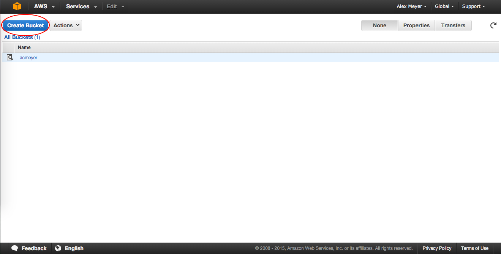
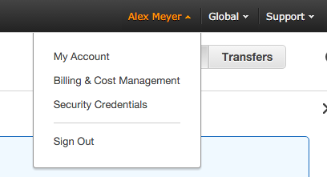
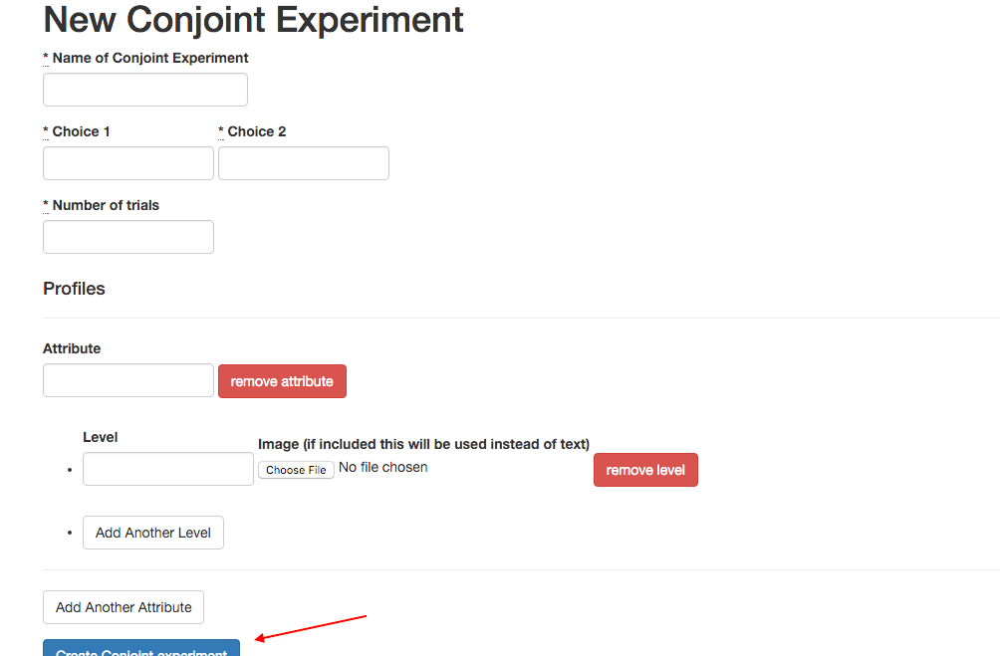
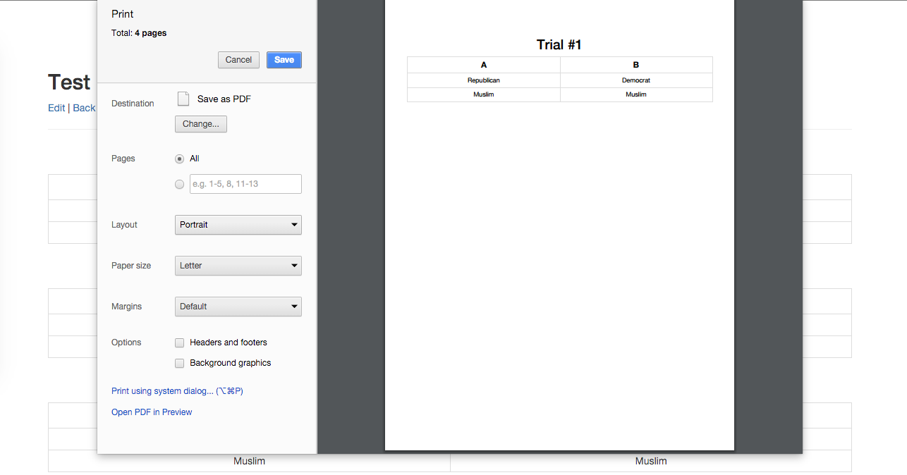

# Conjoint PDF Generator App

A Rails app for producing offline conjoint PDFs.

## Setup

This is a [Ruby on Rails](http://http://rubyonrails.org/) 4.2.0 app. In order to use this app you need to have the 4.2.0 version of Ruby on Rails installed on your local machine and/or web server. For instructions for how to install Ruby on Rails visit [this link](http://installrails.com/). For more information on how to install this app on [Heroku](http://heroku.com) see below.

If you are using images instead of text in your conjoint experiment, you will need to have an Amazon Web Service account and link your credentials in the [conjoint_attribute_value.rb](app/models/conjoint_attribute_value.rb) file on line 12. For more information see below.

### Heroku

The easiest way to use this app is to click on the button below that says "Deploy to Heroku". In order to use this method, you will need to have a Heroku account. It is easy and free to sign up for a Heroku account, which can be done [here](https://signup.heroku.com/?c=70130000001x9jFAAQ). Once you have a Heroku account, just click on the button below and follow the instructions.

Once you have created the Heroku app, you now need to install [Heroku Toolbelt](https://toolbelt.heroku.com/). This will give you command line access to your Heroku app which you will need. After following the link above and installing Heroku Toolbelt on your computer, you need to open up the Terminal app on your computer.

Once the Terminal app is open you need to type the command `heroku login` and hit ENTER. This will then ask you to log into your Heroku account (this is the same account you just created on Heroku). After entering your email and password, you next should run `heroku run rake db:migrate -a name-of-your-app`. Replace 'name-of-your-app' with the name of your app found on Heroku. That will setup and create your app's database.

### AWS S3

If you would like to use images in place of text for your attribute levels, you will need to have an [AWS](http://aws.amazon.com) account. Once you have signed up for an AWS account, sign in to your AWS console, click on the S3 link under **Storage & Content Delivery**. 

In the S3 portion of your console, create a new bucket name. This name will be used to replace the bucket name located on line 12 of the [conjoint_attribute_value.rb](app/models/conjoint_attribute_value.rb) file.

Next, you need to grab your access key id and secret access key. To do this, navigate to the **Security Credentials** portion of your AWS console. This link can be found under your name in the top right corner.

In the **Your Security Credentials** section, open the *Access Keys* panel and click *Create New Access Key*. Make sure you grab both the access key id and secret access key in the popup that shows as you can not get the secret access key again after dismissing this window. Replace your values on line 12 of the [conjoint_attribute_value.rb](app/models/conjoint_attribute_value.rb) file.

## How to Use

The app is very simple to use. The homepage just lists all of your previously made conjoint experiments so that you can find them later. To make a new conjoint experiment, click the *New Conjoint Experiment* button at the top.

Next, fill out the form with the values for your conjoint experiment. If you would like to use images instead of text for a particular level, upload an image. If an image is uploaded, the app will only display the image, not the text. After filling out the form, click the *Create Conjoint experiment* button.

You should now see your generated conjoint experiment tables. To print or get PDFs for your experiment, click the *Print* button. To randomize again, click the *Run Again* button. To create a new conjoint experiment, click the *Create New* button.

## Known Limitations & Future Improvements

* Randomization is currently only done with equal weights
* The code currently does not account for restrictions among attribute levels (for example if you wanted to prevent an immigrant profile from having occupation = doctor and education level = none).
* There is not currently a mechanism of having qualtrics record the order of the attributes that is presented to each respondent, but since the order of attributes is randomized across respondents the order of presentation should not matter.

## Contributing

* Check out the latest master to make sure the feature hasn't been implemented or the bug hasn't been fixed yet
* Check out the issue tracker to make sure someone already hasn't requested it and/or contributed it
* Fork the project
* Start a feature/bugfix branch
* Commit and push until you are happy with your contribution

## License

Released under the MIT License. See [LICENSE](LICENSE) or http://opensource.org/licenses/MIT for more information.

## Other Open Source Projects for Conjoint

* If you also are looking to run conjoint experiments offline on Qualtrics, see our other open source project [here](https://github.com/acmeyer/Conjoint-for-Qualtrics-Offline)

## Credits

* [Leah Rosenzweig](http://www.leahrrosenzweig.com)
* [Alex Meyer](https://twitter.com/alexcmeyer)
* For citations: “Meyer and Rosenzweig 2015”

